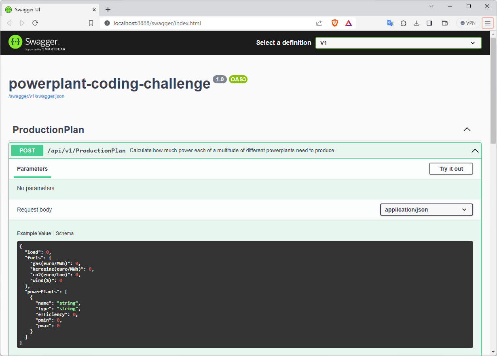
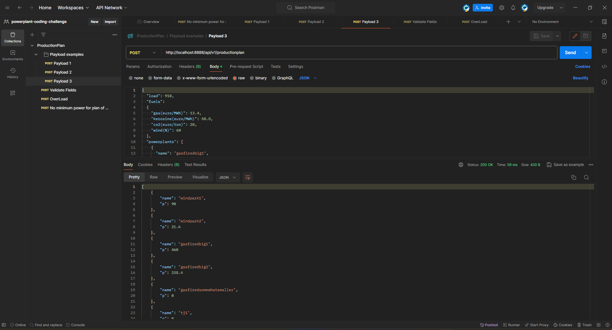

# powerplant-coding-challenge

Calculate how much power each of a multitude of different [powerplants](https://en.wikipedia.org/wiki/Power_station) need to produce (a.k.a. the production-plan) when the [load](https://en.wikipedia.org/wiki/Load_profile) is given and taking into account the cost of the underlying energy sources (gas, kerosine) and the Pmin and Pmax of each powerplant.   
Sum of the power produced by all the powerplants together should be equal the load.

## The Power Calculator solution

### Acceptance criteria
- [x] Contain a README.md explaining how to build and launch the API
- [x] Expose the API on port `8888`

### Optionally
- [x] Docker
- [x] CO2

## Getting Started

### Requirement

- .NET 8
- Visual Studio 2022 version 17.8.0 or higher (recommend version 17.9.0)
- Docker

### Optional

- Postman

## How to build and launch the API

### Visual Studio 2022

Open Visual Studio and following instructions:

- Open `PowerCalculator.sln` in root folder.
- Right click into project `PowerCalculator.WebApi` and select `Set as Startup Project`.
- Click on `Development` menu or type <kbd>F5</kbd> to **build and run**.

### .NET CLI

Open a command prompt, navigate to the `src\PowerCalculator.WebApi` folder and type the following command:

```
dotnet run
```

To stop execute, press `CTRL+C`.

### Docker

Open a command prompt and navigate to the root folder, where contains the `Dockerfile` and type the following command:

- To build the image:

```
docker build -t api-powercalculator-image -f Dockerfile .
```

- To run the container:

```
docker container run -d --name powercalculator-container -p 8888:80 api-powercalculator-image
```

- To stop the container:

```
docker stop powercalculator-container
```

- To start the stopped container:

```
docker start powercalculator-container
```

## How to call the API on Port 8888

You can access the API by sending a POST request to the following URL **http://localhost:8888/api/v1/productionplan** with the JSON payload in the body.

> [!TIP]
> The `example_payloads` folder contains payload examples for tests.

### Swagger

The application will be raised through the URL http://localhost:8888/swagger/index.html automatically if API was build and launch by `Visual Studio 2022`.   
Furthermore, manually open your preferred browser and use the previously mentioned URL to access Swagger.



### Postman

To get started with the Postman collections you will need to download the Postman tool from [getpostman.com/postman](https://www.getpostman.com/postman). 
With Postman installed, you can create requests or download the file of collection with 3 payloads and also some more examples.

[Download file](ProductionPlan.postman_collection.json)


